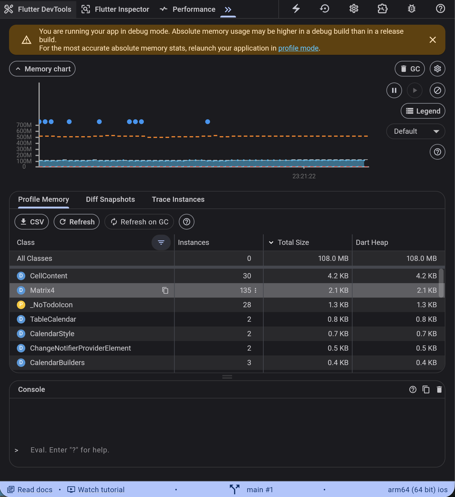
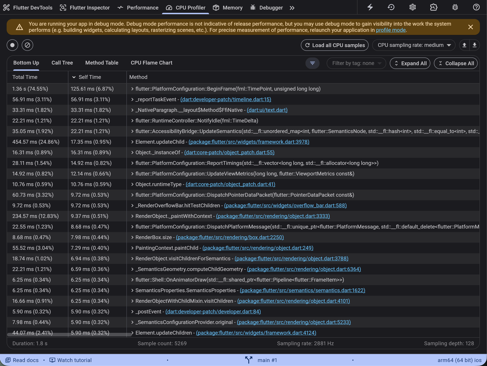
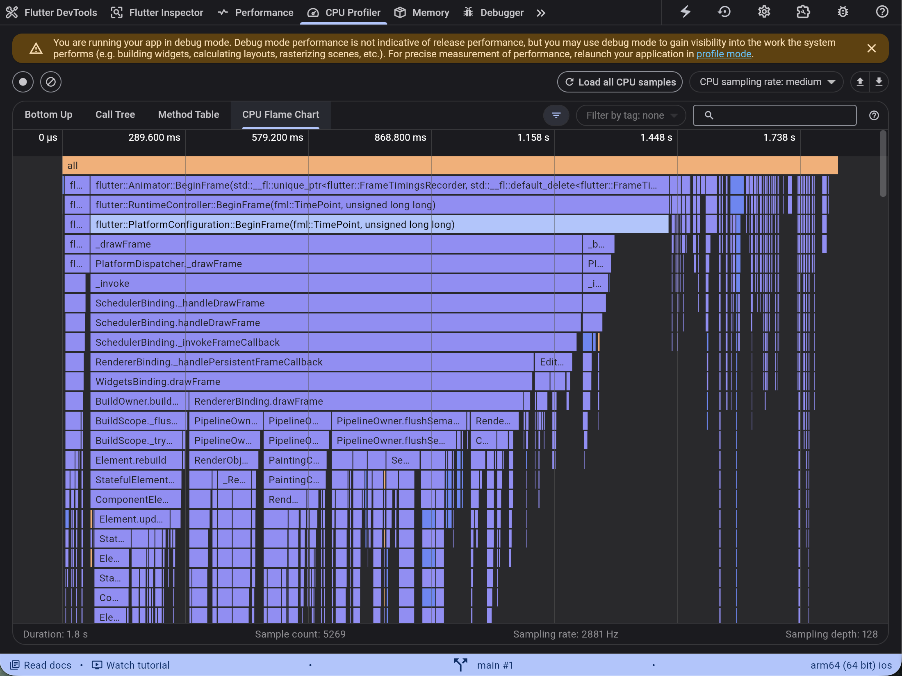

# Flutter To-Do 앱

캘린더 기반 To-Do 관리 앱입니다. 날짜별로 할 일을 추가·삭제하고, 카테고리로 분류할 수 있습니다. 투두메이트 어플리케이션을 참고하였습니다.

---

## 빌드 및 실행 방법

```bash
# 의존성 설치
flutter pub get

# 앱 실행
flutter run

# 특정 디바이스 지정 실행 (예: macOS)
flutter run -d macos
```

> **참고:** macOS / Windows / Linux 데스크톱에서는 `sqflite_common_ffi`를 통해 SQLite를 사용합니다. 별도 설정 없이 실행 가능합니다.

---

## 구조 설명

### 디렉토리 구조

```
lib/
├── main.dart                   # 앱 진입점, ProviderScope 설정
├── db/
│   └── database_helper.dart    # SQLite CRUD (싱글톤)
├── models/
│   ├── task.dart               # Task 데이터 모델
│   └── category.dart           # Category 데이터 모델
├── providers/
│   ├── task_provider.dart      # TaskNotifier (Riverpod ChangeNotifierProvider)
│   └── category_provider.dart  # CategoryNotifier (Riverpod ChangeNotifierProvider)
├── screens/
│   ├── calendar_screen.dart    # 메인 화면 (캘린더 + 할 일 목록)
│   ├── task_form_screen.dart   # 할 일 추가/수정 폼 화면
│   └── category_screen.dart    # 카테고리 관리 화면
└── widgets/
    ├── task_card.dart          # 할 일 카드 위젯
    ├── task_bottom_sheet.dart  # 할 일 상세 바텀시트
    └── category_chip.dart      # 카테고리 칩 위젯
```

### 사용한 주요 Widget

| Widget | 사용 위치 | 역할 |
|---|---|---|
| `TableCalendar` | CalendarScreen | 월간 캘린더, 날짜 선택 |
| `ListView` | CalendarScreen, CategoryScreen | 할 일 목록, 카테고리 목록 |
| `ConsumerStatefulWidget` / `ConsumerWidget` | 각 Screen | Riverpod 상태 구독 |
| `Scaffold`, `AppBar` | 각 Screen | 기본 화면 구조 |
| `AlertDialog` | CategoryScreen | 카테고리 추가/수정/삭제 다이얼로그 |
| `BottomSheet` | task_bottom_sheet | 할 일 상세 조회 |
| `TextFormField` | TaskFormScreen | 할 일 입력 폼 |
| `GestureDetector` | CategoryScreen | 색상 선택 버튼 |

### 상태 자료구조

#### Task 모델
```dart
class Task {
  final int? id;
  final String title;
  final DateTime date;
  final int? categoryId;
  final String? memo;
  final bool isCompleted;
}
```

#### Category 모델
```dart
class Category {
  final int? id;
  final String name;
  final int color; // ARGB int 값
}
```

#### 상태 관리 흐름
- `TaskNotifier` — `List<Task>` 보유, `add` / `update` / `delete` / `toggleComplete` 메서드로 DB와 동기화
- `CategoryNotifier` — `List<Category>` 보유, `add` / `update` / `delete` 메서드로 DB와 동기화
- DB는 `DatabaseHelper` 싱글톤이 SQLite를 통해 영속 저장

---

## 기본 기능 (20점)

### 리스트
캘린더에서 날짜를 선택하면 해당 날짜의 할 일 목록이 아래에 표시됩니다. 각 날짜 위에는 해당 날짜의 할 일 개수가 표시되며, 모든 할 일을 완료하면 숫자 대신 체크 표시로 바뀝니다.


### 추가
카테고리 우측 `+` 버튼을 눌러 할 일을 추가합니다. 제목, 날짜, 카테고리, 메모를 입력할 수 있습니다.


### 삭제
할 일 목록의 우측 삭제 버튼이나 상세 화면의 삭제 버튼을 눌러 삭제합니다.


---

## Bonus Points

### Riverpod 사용 (10점)

`flutter_riverpod` 패키지의 `ChangeNotifierProvider`를 사용해 전역 상태를 관리합니다.

```dart
final taskProvider = ChangeNotifierProvider<TaskNotifier>((ref) {
  return TaskNotifier()..load();
});

final categoryProvider = ChangeNotifierProvider<CategoryNotifier>((ref) {
  return CategoryNotifier()..load();
});
```

- `ref.watch(taskProvider)` — 상태 변경 시 위젯 자동 리빌드
- `ref.read(taskProvider)` — 이벤트 핸들러 내에서 단순 읽기/쓰기
- 앱 최상단을 `ProviderScope`로 감싸 전체 트리에서 Provider 접근 가능

### DevTools 사용 (10점)

Flutter DevTools를 활용해 아래 항목을 분석했습니다.

- **Inspector** — 위젯 트리 구조 확인, 각 위젯의 크기·패딩 검사

- **Timeline** — 프레임 렌더링 시간 측정, 60fps 유지 여부 확인

- **Memory** — 앱 실행 중 메모리 사용량 추적

- **Performance** — CPU/GPU 사용률 모니터링



